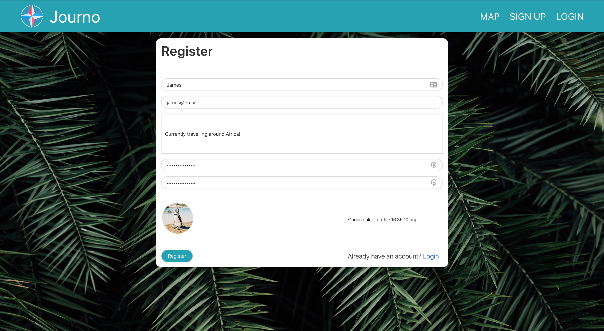

# 

<h1>General Assembly Project Four: Journo</h1>

<h2>Goal: Build a full-stack RESTful app using Python Django REST Framework to serve your data from a PostgreSQL database to a React front-end.</h2>

| Contents                      |                |
| ------------------------------|----------------|
|1. [Overview](#overview)       |6. [Future content](#future)
|2. [Brief](#brief)             |7. [Wins](#wins)
|3. [Technologies used](#tech)  |8. [Blockers](#blockers)
|4. [App](#app)                 |9. [Bugs](#bugs)
|5. [Approach](#approach)       |10. [Future learnings](#learn)

<h2 name='overview'>Overview</h2>

<h3>Introduction</h3>

Journo is a travel diary app that allows you to search via a map of the world yours and other users trips and adventures. The app uses secure routes meaning users must be logged in to view trips and users in detail, and create, edit, and delete their own trips. The app has 2 models and includes React Hooks. Although I saw the huge benefits of working within a team, I decided to work solo on this project because I wanted to learn about the parts I didn't build on the previous project such as security, forms, Cloudinary, logining in, registering and editing profiles.

<h3>Deployment</h3>

The app is deployed on Heroku and can be found here: https://journo-ga.herokuapp.com <br>
The login details are  email: james@email password: Project-4-GA <br>

<h3>Timeframe</h3>

7 days

<h2 name='brief'>Brief</h2>

* **Build a full-stack application** by making your own backend and your own front-end
* **Use a Python Django API** using Django REST Framework to serve your data from a Postgres database
* **Consume your API with a separate front-end** built with React
* **Be a complete product** which most likely means multiple relationships and CRUD functionality for at least a couple of models
* **Implement thoughtful user stories/wireframes** that are significant enough to help you know which features are core MVP and which you can cut
* **You May** use the React Hooks syntax on your front end, but the resposiblity of this will be largely on yourself.
* **Have a visually impressive design** 
* **Be deployed online**


<h2 name='tech'>Technologies used</h2>
<p>1. HTML5 <br>
2. SCSS & Bulma <br>
3. JavaScript (ES6) <br>
4. JSON <br>
5. Python <br>
6. SQL <br>
7. PostgreSQL <br>
8. Django <br>
9. React.js <br>
10. React Hooks <br>
11. Node.js <br>
12. Axios <br>
13. Jest <br>
14. Insomnia <br>
15. Dotenv <br>
16. Cloudinary <br>
17. Mapbox <br>
18. Z shell <br>
19. JWT <br>
20. Yarn <br>
21. Heroku <br>
22. GitHub <br></p>

<h2 name='app'>App</h2>

The user can begin by taking a look around the app when not logged in. They can view the map and a few small details about the trip. As soon as they try to view a trip or profile in more detail they a redirected to log in. The user can register and upload a profile image via Cloudinary or log in with their existing information.<br>
<br>
<br>

<br>
<br>
<br>
They are able to search for any area using the Mapbox built with Hooks and Mapbox Geocoder the interactive map then displays the area and trips within it. The markers display the trips image and then once clicked a pop-up showing some basic info about the trip. This is a link to the trips page where you can see more information and the user that created it.<br>
<br>
<br>

<br>
<br>
<br>
The user can also see the five most recent trips that have been posted, these also work as links.<br>
<br>
<br>

<br>
<br>
<br>
Finally the user can create a trip at anytime from the navbar or go to his profile and edit his information or that of his trips.<br>
<br>
<br>

<br>
<br>
<br>
<h2 name='approach'>Approach</h2>
Being a solo project I listed out a few ideas that interested me. I then mapped out potential features and the technologies behind them. I decided to go with Journo because it was similar to my last project meaning I wouldn't struggle to build it and so could focus on learning new techniques and technologies which I could use to build its features. I used the MoSCoW method to outline my timeline and produced wireframes for each page.
<br>
<br>
<h2 name='future'>Future content</h2>
<h3>Favourites</h3>
I would have liked for it to be possible for users to have favourite trips so they can quickly find them again. <br>
<br>
<br>
<h3>Categories model</h3>
If I had more time I would have built another model called categories. This would have a many-to-many relationship with trips. This would allow trips to be searched under categories of trip, such as sunny, hot, beach, cold, skiing, activity, luxury, backpackers, ect<br>
<br>
<br>
<h2 name='wins'>Wins</h2>
<h3>Python</h3>
This was my first project using Python, I found transition over from JavaScript to be quite easy at this level. The serializers where a specific win as I picked them up straight away and was able to edit their output fields easily.
<br>
<br>
<h3>Hooks</h3>
Hooks were new for me too, I built the map with them as I understood mapbox fairly well. Understanding that useState contains a variable that is whats being stored and it contains a method for updating whats being stored was key to making the map interactive. As we can see below in order for the user to move the map with the click and drag method, whenever the viewport changed I had to take the current viewport and update it with itself, which I still don't understand fully but I do see the basic mechanism.

```javascript
      onViewportChange={viewport => {
        setViewport(viewport)
      }}
```

The rest of the Hooks I found challenging but understood it and definately see the benefits as the code for this mapbox compared to my last one was shorter and in my view simpler and more readable, whilst producing similar effects.

```javascript
  const [viewport, setViewport] = useState({ 
      longitude: 0,
      latitude: 0,
      zoom: 2
  });
  const [trips, setTrips] = useState({})

  const getData = async () => {
        try {
          const token = process.env.REACT_APP_MAPBOX_KEY
          const search = window.location.pathname.split('/').slice(2).join('/')
          const mapStartFocus = await axios.get(`https://api.mapbox.com/geocoding/v5/mapbox.places/${search}.json?access_token=${token}`)
          if (mapStartFocus.data.features.length === 0) {
            this.props.history.push('/map/sudan')
            alert('Sorry we couldn\'t find that address')
          }
          const firstLatLng = mapStartFocus.data.features[0].center
          const viewport = {longitude: firstLatLng[0], latitude: firstLatLng[1], zoom: 5}
          setViewport(viewport)
          const { data } = await axios.get('/api/trips')
          const arrOfLocalAreas = data.map(i => i.local_area)
          Promise.all(arrOfLocalAreas.map(area => {
            return axios.get(`https://api.mapbox.com/geocoding/v5/mapbox.places/${area}.json?access_token=${token}`)
          }))
            .then(res => {
              const latlngs = res.map(r => r.data.features[0].center)
              setTrips(data.map((trip, index) => {
                return {
                  ...trip,
                  latlng: latlngs[index]
                }
              }))
            })
    } catch (err) {
      console.log(err)
    }
  }
```

<h3>Password security</h3>
Last project our password security was poor and so I placed it on my future learnings list. This project I'm happy to say I implemented a system for ensuring strong passwords. Importing django.contrib.auth.password_validation as validations mean't I can use the password validations that come along with django, I then placed the validators I wanted to use in my settings.py file.

```python
import django.contrib.auth.password_validation as validations
from django.core.exceptions import ValidationError

class UserSerializer(serializers.ModelSerializer):

  password = serializers.CharField(write_only=True)
  password_confirmation = serializers.CharField(write_only=True)

  def validate(self, data):
    password = data.pop('password')
    password_confirmation = data.pop('password_confirmation')
    if password != password_confirmation:
      raise serializers.ValidationError({'password_confirmation': 'Does Not Match'})
    try:
      validations.validate_password(password=password)
    except ValidationError as Err:
      raise serializers.ValidationError({'password_confirmation': 'err.messages'})

    data['password'] = make_password(password)

    return data
```


```javascript
function destroy(req, res) {
  User
    .findById(req.params.id)
    .then(user => {
      if (!user.equals(req.currentUser._id)) return res.status(401).json({ message: 'Unauthorized' }) //This line was deleted when merged
      if (!user) return res.status(404).json({ message: 'Not Found ' })
      user.remove().then(() => res.sendStatus(204))
    })
    .catch(err => res.json(err))
}
```
<br>
<br>
<br>

<br>
<br>
<h3>Teamwork</h3>
Although we had issues with git and merging our team worked seamlessly, using trello we democratically divided the tasks and worked quickly and enjoyably together. Helping each other was useful for the team and the individuals doing the help as we all learned from each other and put parts of ourselves into the app. Producing something we were all proud of.<br>
<br>
<br>

<br>
<br>
<h3>Promise.all()</h3>
The whole Mapbox feature was a win for me as I had previously tried in another project to implement markers with pop-ups and failed. A few smaller wins were things such as the user is able to search any area on the home screen and the map would load it, and handling the viewport change, meaning the user could move the map with the mouse. However one really great win for me was learning about the Promise.all() function. Because it is synchronous it allowed me to get the latitude and longitude of each user with the geocoder api in order. Because the Promise waits for each user in the map function to be finished before it starts on the next one, it meant I could setState the user and their coordinates at the same time and not have to worry about the wrong coordinates being attatched to the wrong user.<br>
<br>
<br>

<br>
<br>
<h3>Offers pending</h3>
The offers page was another big win. When the user sends an offer I had to attach the user sending the offer in the back-end with the following code:

```javascript
function offersPendingCreate(req, res) {
  User
    .findById(req.params.id)
    .then(user => {
      if (!user) return res.status(404).json({ message: 'Not Found' })
      if (user.equals(req.currentUser._id)) return res.status(401).json({ message: 'Unauthorized' })
      user.offersPending.push({ offeringUser: req.currentUser }) // attaches offering user
      return user.save()
    })
    .then(user => res.status(201).json(user))
    .catch(err => res.json(err))
}
```

I had to do this because the object has its own ID and therefore could not see how I could use the populate function. I again turned to the Promise.all() function to allow each GET request to return and therefore setState with all the offers in one array.<br>
<br>
<br>
<br>
<br>
<br>
<h3>User email</h3>
I wanted the collaborate button on another users page to change according to if the user had not sent a request, had sent a request and finally if that request had been sent. In the begining this proved tricky but I actually found that like many things I had learned in code, it was deceptively simple and used a ternary statement inside a ternary statement and then just had to find if the current user was inside the offersPending or offersAccepted array:<br>
<br>
<br>


<br>
<br>
<h2 name='blockers'>Blockers</h2>
<h3>Merging</h3>
Using the merge and branch method with git was an interesting new way of working in a group. I can see the benefits and will be happy to work with it in the future. However this particular project it caused a lot of issues and wasted time trying to fix things that were being broken after each merge. I assume one or all of us were using it incorrectly but the random lines of code being deleted all through the app was a big problem in this project.
<br>
<br>
<h3>Offers</h3>
Although the offers feature was a win for me getting there was difficult. It took me half a day to understand how I could delete an offer. I was struggling to delete the offer because I could not find a unique ID in the offer by which to identify and remove it. I eventually discovered I could attach it to the request but because the acceptedUser and offereyid were different objects in memory I could only use the equality operator rather than the strict equality operator.
<br>
<br>

<br>
<br>
<h2 name='bugs'>Bugs</h2>
<h3>Passwords</h3>
Unfortunately we did not include a way to make sure that the user had to create a secure password that was at least 8 characters long and contained uppercase and lowercase letters and numbers.
<br>
<br>
<h3>Edit profile</h3>
The users image does not load for the edit page as we were focusing on finishing the app and did not donate enough time to figureing out how were could uses the profile image as an upload button that would change.
<br>
<br>

<br>
<br>
<h3>SCSS</h3>
The styling also has sections that are glitchy and ugly. It is not very responsive however we proritised the time we had on functionality and features.
<h2 name='learn'>Future learnings</h2>
• Learn about refs<br>
• Include password security features<br>
• Get a better understanding of objects in memory and equality operators<br>
